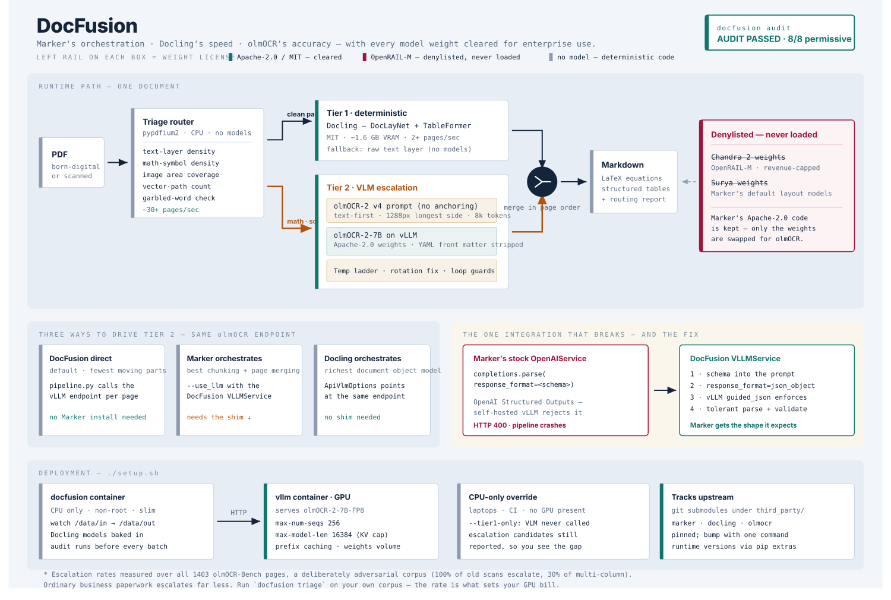

# DocFusion

License-compliant enterprise document intelligence. Combines three open ecosystems — **Marker** (Apache-2.0 harness), **IBM Docling** (MIT deterministic pipeline), and **Ai2 olmOCR** (Apache-2.0 VLM) — while keeping every *model weight* in the runtime BOM enterprise-permissive. The OpenRAIL-M-restricted Chandra/Surya weights are explicitly denylisted and can never enter the pipeline.

```
             ┌────────────────────────────────────────────────┐
 PDF ──────► │  Model-free triage (pypdfium2, CPU, ~9ms/page) │
             └───────┬───────────────────────────┬────────────┘
                     │ clean pages               │ math / scans / dense tables
                     ▼                           ▼
        Tier 1: Docling (MIT)          Tier 2: olmOCR-2-7B on local vLLM
        DocLayNet + TableFormer        exact v4 prompt · no anchoring
        OCR off by default             temp ladder · rotation fix · loop guards
                     │                           │
                     └────────────► Merged Markdown (page order)
```



## Why this exists

Marker's *code* is Apache-2.0, but its accuracy comes from **Chandra/Surya weights under OpenRAIL-M** — free only below a $2–5M revenue cap. DocFusion swaps in **olmOCR 2** (Apache-2.0) and reserves it for the pages that actually need visual reasoning. A built-in license audit (`docfusion audit`) fails closed if any restricted component enters the runtime bill of materials.

On olmOCR-Bench the two models are much closer than headline marketing suggests — **Chandra 0.1.0 at 83.1 ±0.9 vs olmOCR-2 at 82.4 ±1.1**, overlapping error bars ([upstream results table](third_party/olmocr/olmocr/bench/README.md)). You are trading roughly a point of benchmark accuracy for unrestricted commercial use.

## Measured, not asserted

Everything below was produced in this repo against a live `allenai/olmOCR-2-7B-1025` on vLLM (RTX 3090, bf16) and the real 1403-PDF olmOCR-Bench. Scores come from olmOCR's own scorer in `third_party/olmocr`, so they are comparable to the published table. Reproduce with `make stress`, `make compare`, `docfusion bench`.

### Triage routing (all 1403 bench pages, `scripts/stress_triage.py`)

| category | pages | escalated |
|---|---:|---:|
| old_scans | 98 | 100.0% |
| old_scans_math | 36 | 100.0% |
| long_tiny_text | 62 | 77.4% |
| arxiv_math | 522 | 64.9% |
| tables | 188 | 41.5% |
| headers_footers | 266 | 30.5% |
| multi_column | 231 | 30.3% |
| **total** | **1403** | **53.5%** |

53 pages/sec, no crashes, median 8.5 ms/page. Note that **olmOCR-Bench is a deliberately adversarial corpus** — it was curated from the cases OCR systems fail. The "~80% of pages stay on Tier 1" figure often quoted for this architecture is not what a hard corpus produces; ordinary business paperwork escalates far less. Run `docfusion triage` over your own documents before budgeting GPUs, because the escalation rate *is* the GPU bill.

The routing has the right shape: every old scan escalates, most math escalates, and clean multi-column prose mostly does not.

### Does the pipeline query olmOCR-2 correctly?

Routing every page to the VLM should reproduce Ai2's published olmOCR-2 scores. It does:

| category | DocFusion (all-VLM) | Ai2 published |
|---|---:|---:|
| multi_column | **83.8** | 83.7 |
| tables | **84.8** | 84.9 |

419 pages, 0 failures. Matching to within 0.1 is the evidence that the contract in `olmocr_protocol.py` is right — a client using an invented prompt, or leaving the YAML front matter in the output, cannot land there.

### What does triage actually cost?

Same 419 pages (`tables` + `multi_column`), same model, three topologies. RTX 3090, bf16, 8 concurrent documents, Docling on CPU.

| topology | overall | multi_column | tables | escalated | wall | pages/s |
|---|---:|---:|---:|---:|---:|---:|
| all-VLM | **89.6** ±1.1 | 83.8 | 84.8 | 100% | 2339 s | 0.18 |
| **hybrid (default)** | **84.4** ±1.3 | 74.9 | 78.2 | 35% | **1156 s** | **0.36** |
| Tier-1 only | 74.2 ±1.6 | 64.6 | 61.3 | 0% | 1328 s | 0.32 |
| Tier-1 only, no Docling | 53.4 ±1.3 | 65.6 | 0.1 | 0% | 38 s | 11.0 |

Four things worth taking from this:

1. **Triage costs 5.2 points for a 2× speedup.** That is the trade in one number. Whether it is worth it is a corpus and budget question, not an architectural one — which is exactly why this is measured rather than asserted.
2. **Hybrid strictly dominates Tier-1-only** — more accurate *and* faster. The "cheap" deterministic tier is not cheaper here: Docling on CPU runs ~3.2 s/page, slower per page than offloading to a GPU that would otherwise sit idle. The oft-quoted "Docling does 2.1 pages/s" assumes Docling gets a GPU, and on a single-GPU box it cannot have one — vLLM has already claimed the VRAM.
3. **Docling earns its place in Tier 1**: 74.2 vs 53.4 against the raw text layer, and on tables **61.3 vs 0.1**. A text layer emits no table structure whatsoever, so every table test fails.
4. **Triage is under-escalating on tables** (78.2 hybrid vs 84.8 all-VLM). For table-heavy corpora, lower `max_path_objects` to buy accuracy with GPU time.

Reproduce: `make compare` (or `scripts/compare_topologies.py`).


## Repository layout

```
src/docfusion/
  triage/heuristics.py         # model-free FAST/VLM router
  engines/olmocr_protocol.py   # the olmOCR-2 wire contract (prompt, rendering, front matter, guards)
  engines/olmocr_client.py     # transport: temperature ladder, rotation retry, fallback
  engines/docling_engine.py    # Tier 1 + Docling-as-orchestrator VLM options
  services/vllm_service.py     # Marker BaseService shim (schema-in-prompt, not OpenAI response_format)
  bench/harness.py             # olmOCR-Bench runner; scoring delegated to upstream's scorer
  hardware.py                  # GPU capability detection → vLLM serving plan
  pdfium_lock.py               # process-wide PDFium serialisation (see Concurrency)
  licenses.py                  # component registry, denylist, audit
  pipeline.py, cli.py, config.py, anchoring.py
third_party/                   # upstream projects as git submodules (marker, docling, olmocr)
scripts/                       # stress_triage.py, compare_topologies.py
tests/                         # 95 tests incl. a mock vLLM reproducing real 400s and real reply format
```

Upstream projects are tracked as **git submodules** so this library evolves with them:

```bash
git clone --recurse-submodules <repo>
git submodule update --remote --depth 1     # bump to latest upstreams
```

The submodules are load-bearing, not decorative:

- `test_prompt_matches_upstream` compares the vendored olmOCR-2 prompt against `third_party/olmocr` and **fails if upstream changes it**, so a silent drift into off-distribution prompting is impossible.
- Benchmark scoring shells out to `python -m olmocr.bench.benchmark` in the submodule, so scores stay comparable to the published table and upstream fixes to equation/table comparison arrive with a submodule bump.

Runtime integration is via pip extras so you control versions independently:

```bash
pip install docfusion                # lightweight core: triage + protocol + vLLM client
pip install "docfusion[docling]"     # Tier-1 deterministic engine
pip install "docfusion[marker]"      # Marker harness (code only — see license note)
pip install "docfusion[serve]"       # vLLM for hosting olmOCR locally
```

> **License note on `[marker]`:** installing `marker-pdf` will attempt to download Surya weights (OpenRAIL-M). Use Marker only as the `--use_llm` orchestrator with the DocFusion `VLLMService`, or skip Marker entirely. `docfusion audit` documents exactly what is cleared.

## Serving olmOCR

Run the preflight first — it reads your GPU and picks the right build:

```bash
docfusion preflight
```

**FP8 is not universal.** `allenai/olmOCR-2-7B-1025-FP8` is what the olmOCR README shows, and it needs compute capability **≥ 8.9** (Ada/Hopper/Blackwell: L40S, RTX 4090, H100, B200). **A100 is 8.0 and RTX 3090/A6000 are 8.6** — no FP8 tensor cores. On those cards use the bf16 repo `allenai/olmOCR-2-7B-1025`, which needs ~16 GB for weights alone. `docfusion preflight` and `setup.sh` both detect this and choose for you.

```bash
vllm serve allenai/olmOCR-2-7B-1025-FP8 \
  --max-num-seqs 256 --max-model-len 16384 \
  --enable-prefix-caching --port 8000
```

`--max-model-len` is deliberately capped: high-res page images consume context fast, and an oversized KV cache is the classic OOM/pod-crash mode. Measured on an RTX 3090 at `--gpu-memory-utilization 0.92`: weights 15.63 GiB, KV cache 72,944 tokens, 4.45 concurrent requests at full context.

**Pin your vLLM version.** `:latest` has broken this stack: 0.26 removed `--disable-log-requests`, and its `UvaBuffer` path aborts wherever pinned memory is unavailable (notably WSL2). `.env.example` pins `v0.11.2`, the version olmOCR itself pins.

## Docker quick start

```bash
git clone --recurse-submodules <repo> && cd docfusion
./setup.sh            # checks docker + NVIDIA runtime, picks FP8/bf16, builds, audits, starts watch mode
# drop PDFs into ./data/in → Markdown appears in ./data/out
```

```bash
./setup.sh --smoke    # also runs an end-to-end conversion through the real olmOCR
./setup.sh --cpu      # no GPU: Tier-1-only; would-be escalations reported, not sent
make logs
docker compose run --rm docfusion triage /data/in/report.pdf
docker compose run --rm docfusion batch /data/in /data/out --skip-existing
```

## Usage

```bash
docfusion audit                     # verify runtime BOM is enterprise-permissive
docfusion preflight                 # GPU capability → serving plan
docfusion triage report.pdf         # per-page FAST/VLM decisions with reasons (no models needed)
docfusion convert report.pdf -o out.md --vlm-base-url http://localhost:8000/v1
docfusion batch ./in ./out --doc-workers 8
docfusion bench .bench_data --json-out results.json
```

```python
from docfusion import DocFusionPipeline, PipelineConfig

cfg = PipelineConfig()
cfg.vlm.base_url = "http://localhost:8000/v1"
result = DocFusionPipeline(cfg).convert("report.pdf")
print(result.markdown)
print(result.summary())   # pages, escalation rate, degraded/fallback pages, token counts
```

### Concurrency

Two independent knobs, because they solve different problems:

- `--workers` parallelises **pages within one document**.
- `--doc-workers` parallelises **documents**. On a corpus of single-page scans `--workers` does nothing at all, and the GPU sits idle between pages.

**PDFium is serialised process-wide** (`docfusion.pdfium_lock`). It keeps global state and is not thread-safe; a per-thread `PdfDocument` is *not* sufficient isolation, and concurrent access aborts the process with a native `munmap_chunk(): invalid pointer` — no traceback. The lock is held across rasterisation (tens of milliseconds) and released for the inference wait (seconds), so throughput is unaffected.

### Using Marker as the orchestrator instead

Marker's stock `OpenAIService` calls `chat.completions.parse(..., response_format=<schema>)` — OpenAI's Structured Outputs contract, which vLLM rejects with HTTP 400 (`Input should be 'text' or 'json_object'`). DocFusion ships a drop-in service that injects the JSON schema into the prompt (plus vLLM `guided_json`) and tolerantly extracts/validates the reply:

```bash
marker_single report.pdf --use_llm \
  --llm_service docfusion.services.vllm_service.VLLMService \
  --vllm_base_url http://localhost:8000/v1 \
  --vllm_model allenai/olmOCR-2-7B-1025
```

### Using Docling as the orchestrator instead

```python
from docfusion.engines.docling_engine import build_docling_vlm_options
opts = build_docling_vlm_options()   # ApiVlmOptions → local olmOCR, using the real v4 prompt
```

## The olmOCR-2 contract (why `olmocr_protocol.py` exists)

olmOCR-2 is a fine-tuned model and only performs at benchmark level when queried the way it was trained. `engines/olmocr_protocol.py` pins that contract:

| | |
|---|---|
| prompt | `build_no_anchoring_v4_yaml_prompt()` — **no anchoring** |
| message order | text part **first**, then image |
| image | longest side 1288 px (not a DPI) |
| max_tokens | 8000 |
| temperature | ladder starting at 0.1, escalating on retry |
| response | **YAML front matter** + Markdown body |
| tables | HTML, not Markdown pipes |

Two traps worth naming:

- **Anchoring is obsolete for this model.** olmOCR v1 injected the PDF text layer into the prompt; olmOCR-2 was trained without it, and upstream's own `--target_anchor_text_len` is documented "not used for new models". `anchoring.py` is retained for v1-era models and the fallback path, gated behind `VLMEndpoint.use_anchoring` (default off).
- **The reply is not bare Markdown.** It starts with `---\nprimary_language: ...\n---`. Returning `message.content` verbatim leaks that header into every escalated page.

### Supply chain

Docling's OCR engine is **off by default** (`PipelineConfig.docling_ocr=False`). Enabled, it initialises RapidOCR, which downloads PP-OCR weights from `modelscope.cn` on first *conversion* — a model family entering the runtime BOM from an unaudited host, at runtime rather than install time. It is also redundant here: triage sends every weak-text-layer page to Tier 2, so a page reaching Docling has a text layer worth trusting. The component is registered in `licenses.py` and must be cleared explicitly before you turn it on.

## Testing

```bash
pip install "docfusion[dev]"
pytest
```

95 tests. The suite generates fixture PDFs and runs a **mock vLLM server** that reproduces real vLLM behaviour — both its rejection of the OpenAI structured-outputs shape *and* olmOCR-2's real YAML-front-matter reply format. That second part matters: an earlier mock returned clean Markdown, so 31 tests passed against a client that would have leaked front matter into every page in production. Fixtures should imitate the dependency, not your expectations of it.

Also covered: the retry ladder, rotation correction, salvage-on-exhaustion and text-layer fallback; PDFium thread-safety under 8-way concurrency; and `test_prompt_matches_upstream`, which fails if the submodule's prompt drifts.

## License

DocFusion itself: Apache-2.0. See `docfusion audit` for the full runtime bill of materials.
